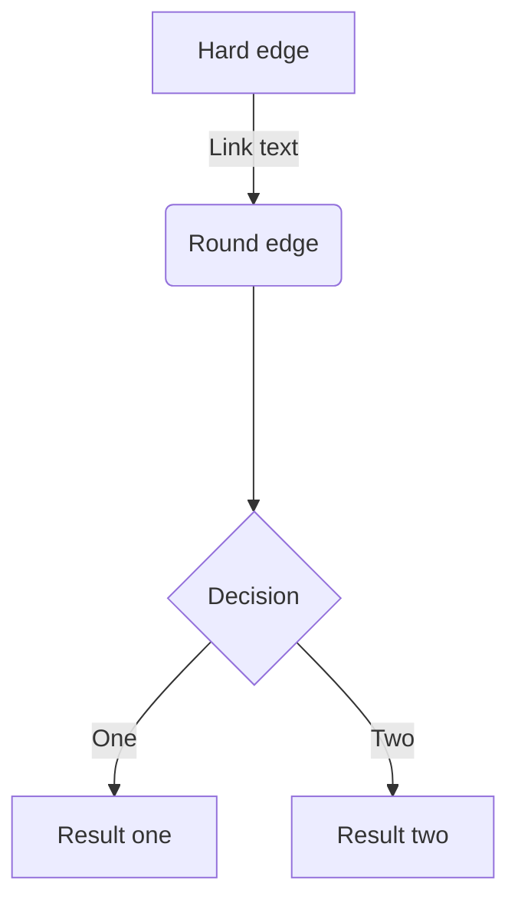
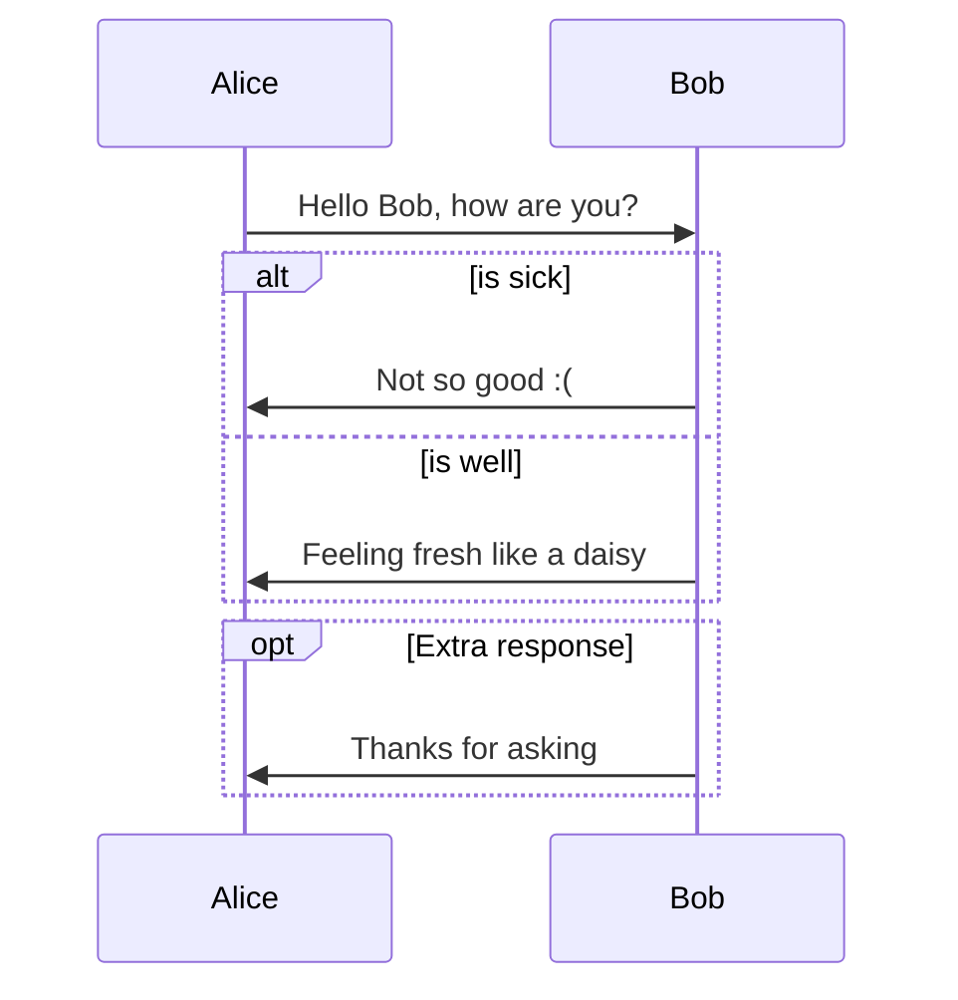
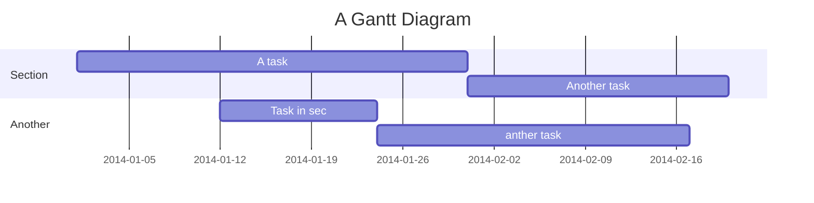
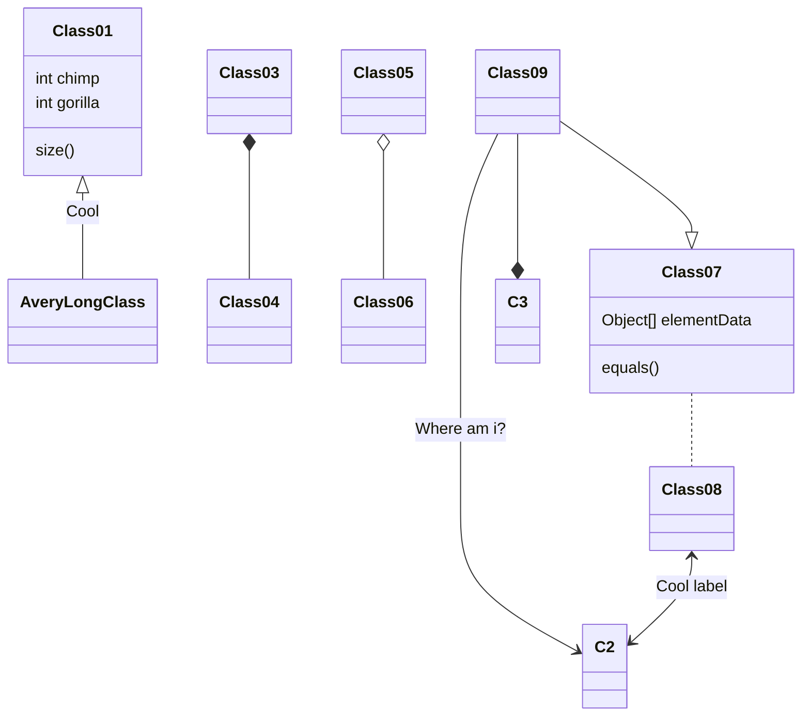

# Markdown Core

website.com

http://website.com

https://website.com

test@website.com

Press <kbd>Ctrl</kbd> + <kbd>D</kbd>(or <kbd>Cmd</kbd> + <kbd>D</kbd> on Mac) to bookmark this page.

std::string

---

## Table of Contents

[toc]


## Charts

### Line Chart

```chart
{
  "type": "line",
  "data": {
    "labels": [
      "January",
      "February",
      "March",
      "April",
      "May",
      "June",
      "July"
    ],
    "datasets": [
      {
        "label": "# of bugs",
        "fill": false,
        "lineTension": 0.1,
        "backgroundColor": "rgba(75,192,192,0.4)",
        "borderColor": "rgba(75,192,192,1)",
        "borderCapStyle": "butt",
        "borderDash": [],
        "borderDashOffset": 0,
        "borderJoinStyle": "miter",
        "pointBorderColor": "rgba(75,192,192,1)",
        "pointBackgroundColor": "#fff",
        "pointBorderWidth": 1,
        "pointHoverRadius": 5,
        "pointHoverBackgroundColor": "rgba(75,192,192,1)",
        "pointHoverBorderColor": "rgba(220,220,220,1)",
        "pointHoverBorderWidth": 2,
        "pointRadius": 1,
        "pointHitRadius": 10,
        "data": [
          65,
          59,
          80,
          81,
          56,
          55,
          40
        ],
        "spanGaps": false
      }
    ]
  },
  "options": {}
}
```

### Bar Chart

```chart
{
  "type": "bar",
  "data": {
  "labels": [
    "Red",
    "Blue",
    "Yellow",
    "Green",
    "Purple",
    "Orange"
  ],
  "datasets": [
    {
    "label": "# of Votes",
    "data": [
      12,
      19,
      3,
      5,
      2,
      3
    ],
    "backgroundColor": [
      "rgba(255, 99, 132, 0.2)",
      "rgba(54, 162, 235, 0.2)",
      "rgba(255, 206, 86, 0.2)",
      "rgba(75, 192, 192, 0.2)",
      "rgba(153, 102, 255, 0.2)",
      "rgba(255, 159, 64, 0.2)"
    ],
    "borderColor": [
      "rgba(255,99,132,1)",
      "rgba(54, 162, 235, 1)",
      "rgba(255, 206, 86, 1)",
      "rgba(75, 192, 192, 1)",
      "rgba(153, 102, 255, 1)",
      "rgba(255, 159, 64, 1)"
    ],
    "borderWidth": 1
    }
  ]
  },
  "options": {}
}
```

### Radar Chart

```chart
{
  "type": "radar",
  "data": {
    "labels": [
      "Eating",
      "Drinking",
      "Sleeping",
      "Designing",
      "Coding",
      "Cycling",
      "Running"
    ],
    "datasets": [
      {
        "label": "My First dataset",
        "backgroundColor": "rgba(179,181,198,0.2)",
        "borderColor": "rgba(179,181,198,1)",
        "pointBackgroundColor": "rgba(179,181,198,1)",
        "pointBorderColor": "#fff",
        "pointHoverBackgroundColor": "#fff",
        "pointHoverBorderColor": "rgba(179,181,198,1)",
        "data": [
          65,
          59,
          90,
          81,
          56,
          55,
          40
        ]
      },
      {
        "label": "My Second dataset",
        "backgroundColor": "rgba(255,99,132,0.2)",
        "borderColor": "rgba(255,99,132,1)",
        "pointBackgroundColor": "rgba(255,99,132,1)",
        "pointBorderColor": "#fff",
        "pointHoverBackgroundColor": "#fff",
        "pointHoverBorderColor": "rgba(255,99,132,1)",
        "data": [
          28,
          48,
          40,
          19,
          96,
          27,
          100
        ]
      }
    ]
  },
  "options": {}
}
```

### Polar Area Chart

```chart
{
  "type": "polarArea",
  "data": {
    "datasets": [
      {
        "data": [
          11,
          16,
          7,
          3,
          14
        ],
        "backgroundColor": [
          "#FF6384",
          "#4BC0C0",
          "#FFCE56",
          "#E7E9ED",
          "#36A2EB"
        ],
        "label": "My dataset"
      }
    ],
    "labels": [
      "Red",
      "Green",
      "Yellow",
      "Grey",
      "Blue"
    ]
  },
  "options": {}
}
```

### Pie Chart

```chart
{
  "type": "pie",
  "data": {
    "labels": [
      "Red",
      "Blue",
      "Yellow"
    ],
    "datasets": [
      {
        "data": [
          300,
          50,
          100
        ],
        "backgroundColor": [
          "#FF6384",
          "#36A2EB",
          "#FFCE56"
        ],
        "hoverBackgroundColor": [
          "#FF6384",
          "#36A2EB",
          "#FFCE56"
        ]
      }
    ]
  },
  "options": {}
}
```

### Doughnut Chart

```chart
{
  "type": "doughnut",
  "data": {
    "labels": [
      "Red",
      "Blue",
      "Yellow"
    ],
    "datasets": [
      {
        "data": [
          300,
          50,
          100
        ],
        "backgroundColor": [
          "#FF6384",
          "#36A2EB",
          "#FFCE56"
        ],
        "hoverBackgroundColor": [
          "#FF6384",
          "#36A2EB",
          "#FFCE56"
        ]
      }
    ]
  },
  "options": {}
}
```

### Bubble Chart

```chart
{
  "type": "bubble",
  "data": {
    "datasets": [
      {
        "label": "First Dataset",
        "data": [
          {
            "x": 20,
            "y": 30,
            "r": 15
          },
          {
            "x": 40,
            "y": 10,
            "r": 10
          }
        ],
        "backgroundColor": "#FF6384",
        "hoverBackgroundColor": "#FF6384"
      }
    ]
  },
  "options": {}
}
```

---

## headings
### heading 3
#### 标题 4
#### 标题 4
#### 标题 4
#### 标题
#### 标题
#### 标题
##### heading 5
###### heading 6


## Github Flavored Markdown

~~strikethrough~~

header 1 | header 2
---|---
row 1 col 1 | row 1 col 2
row 2 col 1 | row 2 col 2

http://example.com

do_this_and_do_that_and_another_thing.


## Fontawesome: :fa-cab: :fa-flag: :fa-bicycle: :fa-leaf: :fa-heart: :fa-does-not-exist:

:fa-cab: :fa-flag: :fa-bicycle: :fa-leaf: :fa-heart: :fa-does-not-exist:


## Emoji: :panda_face: :sparkles: :camel: :boom: :pig: :does_not_exist:

:panda_face: :sparkles: :camel: :boom: :pig: :does_not_exist:


## Task lists

- hello world
- [ ] @mentions, #refs, [links](), **formatting**, and <del>tags</del> are supported
- [x] list syntax is required (any unordered or ordered list supported)
1. [x] this is a complete item
- [ ] this is an incomplete item **test** [ ] again


- [ ] a bigger project
  - [x] first subtask
  - [x] follow up subtask
  - [ ] final subtask
- [ ] a separate task


## Code blocks

Before inline code `$(() => { console.log('Hello world') });` after inline code.

```ruby
[1, 2, 3, 4, 5].collect do |item|
  item * 2
end
```


```js
$(document).ready(() => {
  $('pre code').each((i, block) => {
    hljs.highlightBlock(block);
  });
});
```


    for i in range(1, 10):
        print 'Hello world {0}'.format(i)


## HTML code

<strong>Hello world</strong>


## Math

Inline math: `$E = mc^2$`, another one: `$\dfrac{ \tfrac{1}{2}[1-(\tfrac{1}{2})^n] }{ 1-\tfrac{1}{2} } = s_n$`.


```katex
\oint_C x^3\, dx + 4y^2\, dy

2 = \left(
 \frac{\left(3-x\right) \times 2}{3-x}
 \right)

\sum_{m=1}^\infty\sum_{n=1}^\infty\frac{m^2\,n}
 {3^m\left(m\,3^n+n\,3^m\right)}
```

```math
\phi_n(\kappa) =
 \frac{1}{4\pi^2\kappa^2} \int_0^\infty
 \frac{\sin(\kappa R)}{\kappa R}
 \frac{\partial}{\partial R}
 \left[R^2\frac{\partial D_n(R)}{\partial R}\right]\,dR
```


## AsciiMath

Inline AsciiMath: `@(1/2[1-(1/2)^n])/(1-(1/2))=s_n@`

```AsciiMath
oint_Cx^3 dx+4y^2 dy

2=(((3-x)xx2)/(3-x))

sum_(m=1)^oosum_(n=1)^oo(m^2 n)/(3^m(m3^n+n3^m)
```

```ASCIIMath
phi_n(kappa) = 1/(4pi^2 kappa^2)
 int_0^oo (sin(kappa R))/(kappa R)
 del/(del R)
[R^2 (del D_n (R))/(del R)] del R
```


## Flowchart



```
graph TD
    A[Hard edge] -->|Link text| B(Round edge)
    B --> C{Decision}
    C -->|One| D[Result one]
    C -->|Two| E[Result two]
```


## Sequence diagram




## Gantt diagram




## Class diagram




## Git graph


## Subscript: H~2~O


## Superscript: 29^th^


## Footnote

Here is a footnote reference,[^1] and another.[^longnote]

[^1]: Here is the footnote.

[^longnote]: Here's one with multiple blocks.

    Subsequent paragraphs are indented to show that they
belong to the previous footnote.


Here is an inline note.^[Inlines notes are easier to write, since
you don't have to pick an identifier and move down to type the
note.]


## Blockquotes

> Blockquotes can also be nested...
>> ...by using additional greater-than signs right next to each other...
> > > ...or with spaces between arrows.


## Start list with offsets

5. line one
1. line two
12. line three


## Custom containers

::: success
success container

**service@tylingsoft.com**
:::

::: info
info container

**service@tylingsoft.com**
:::

::: warning
warning container

**service@tylingsoft.com**
:::

::: danger
danger container

**service@tylingsoft.com**
:::


## Abbreviations

Before the HTML & W3C definition.
*[HTML]: Hyper Text Markup Language
*[W3C]:  World Wide Web Consortium
The HTML specification is maintained by the W3C.


## Definition list

Term 1

:   Definition 1
with lazy continuation.

Term 2 with *inline markup*

:   Definition 2

        { some code, part of Definition 2 }

    Third paragraph of definition 2.

_Compact style:_

Term 1
  ~ Definition 1

Term 2
  ~ Definition 2a
  ~ Definition 2b


## insert

++Inserted text++


## mark

==Marked text==
